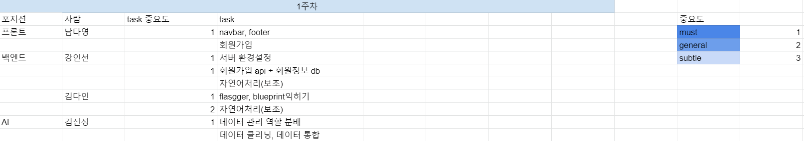

# 오늘옷데 웹 서비스 기획서

## 목차
1. [웹 서비스 소개](#1.-웹-서비스-소개)
2. [스토리보드](#2.-스토리보드)
3. [프로젝트 구성](#3.-프로젝트-구성)
4. [구현 기능](#4.-구현-기능)
5. [와이어프레임](#5.-와이어프레임)
6. [세부 일정](#6.-세부-일정)
7. [역할](#7. 역할)
8. [배운 점](#8.-배운-점)
9. [Citation](#Citation)

## 1. 웹 서비스 소개

- **사용자 취향 기반 실시간 옷 추천 서비스** 
- **선정 배경** : 
    현재 대부분의 쇼핑몰은 인기순, 가격순, 판매순으로 정렬 기준을 제시하고 있다. 이에 고객이 직접 찾고자 하는 옷에 해당하는 카테고리를 찾아 원하는 기준으로 정렬을 해서 제품을 찾아야 한다. 이렇게 했을 때의 문제점으로는 엉뚱한 상품이 맨 앞에 정렬되어 나온다는 점, 원하는 디자인을 찾기 쉽지 않다는 점이 있다. 이러한 문제점을 해결하고자 오늘옷데 서비스를 기획하게 되었다.
- **문제 정의** : 
    오늘옷데는 기존의 '사용자가 원하는 카테고리와 정렬을 선택하여 옷을 찾는' 패러다임을 뒤집어 고객이 원하는 옷과 키워드에서 인공지능이 카테고리를 추출하여 비슷한 다른 옷들을 제시하는 서비스를 제공한다. 이를 통해 개인은 취향에 맞는 키워드와 옷을 고름으로서 맞춤형 옷을 쉽고 편하게 찾을 수 있다.

## 2. 스토리보드

- 앞서 정의한 문제점에 따라 스토리보드를 구상했다. 
- 상세 스토리보드 링크는 다음과 같다 : [스토리보드 링크](https://miro.com/app/board/o9J_lE7TxL8=/)

## 3. 프로젝트 구성
1. **필요한 데이터셋**
- Amazon review data (2018) Jianmo Ni, UCSD
2. **기술 스택 및 라이브러리**

    | 분류 | Tools | 목적 |
    | ------ | ------ | ------ |
    | Server | Flask | 웹 서버 구동 |
    | DB | MySQL(SQLAlchemy) | 데이터베이스 |
    | APIspec | Flasgger | API 문서화 |
    | API Component | Blueprint | API 모듈화 |
    | Front Framework | React | spa 구현 |
    | State Container | Recoil | React 상태 관리 |
    | Open Source Form Library | Formik | Form 제어 |
    | NLP | NLTK | 영어 텍스트 전처리 |
    | NLP | Pickle | 8개 국어 자연어 전처리 |

## 4. 구현 기능
> 이후 구현된 기능에 알맞는 스크린샷, 영상 등을 추가합니다.
1. **필수 구현**
    - 1순위 : Authentication - 회원가입 / 로그인 / 마이페이지(회원정보수정 / 회원탈퇴)
    - 2순위 : 핵심 기능 - 취향찾기 / 키워드 검색
    - 3순위 : 옷장 - 찜하기를 바탕으로 내 코디 만들기
2. **선택 구현**
    - 1순위 : 카카오 로그인

## 5. 와이어프레임

- 스토리보드와 필수/선택 구현 기능을 바탕으로 상세한 와이어프레임을 작성하였다.
- 꾸준히 업데이트 중에 있다.
- 상세 와이어 프레임 링크는 다음과 같다 : [와이어 프레임 링크](https://miro.com/app/board/o9J_lE5n5Oc=/)

## 6. 세부 일정

- 1주차 세부 일정을 정해놓고 개발 진행 중에 있다.
- 지속적으로 업데이트 예정이다.
- 세부 일정계획표는 다음과 같다 : [일정계획표 링크](https://docs.google.com/spreadsheets/d/1yF4glEA5jkFh3WHKs-dg1c-SEEmsH1NQhvRmaZRKmcA/edit?usp=sharing)

##7. 역할

| 이름 | 담당 업무 |
| ------ | ------ |
| 강인선 | 백엔드 |
| 김다인 | 백엔드 |
| 김신성 | 인공지능 |
| 남다영 | 프론트엔드 |
| 황정우 | 프론트엔드 |

## 8. 배운 점
- 인공지능 프로젝트에서 배운 점과 느낀 점 등을 정리합니다.

## Citation
- Justifying recommendations using distantly-labeled reviews and fined-grained aspects Jianmo Ni, Jiacheng Li, Julian McAuley
- Empirical Methods in Natural Language Processing (EMNLP), 2019

