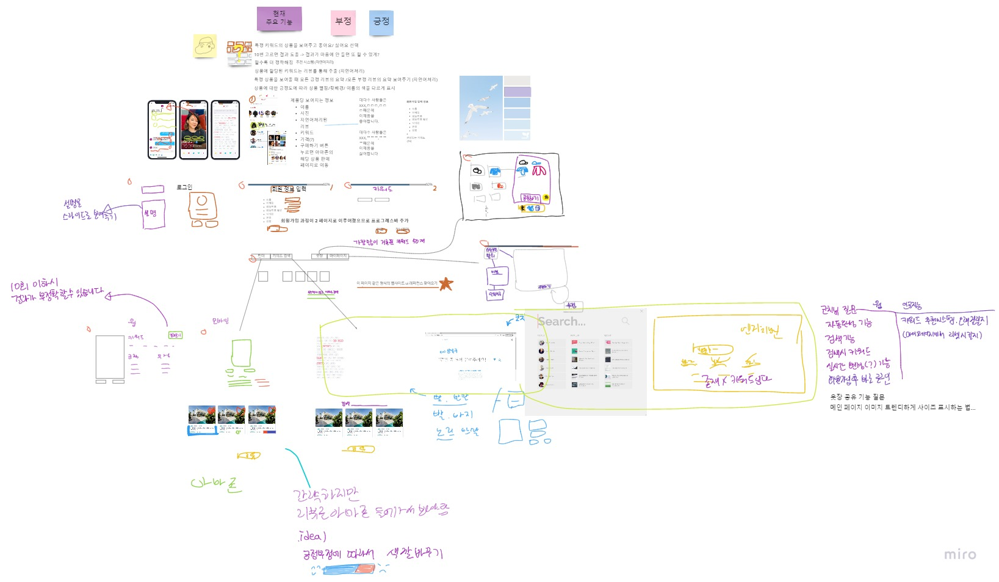
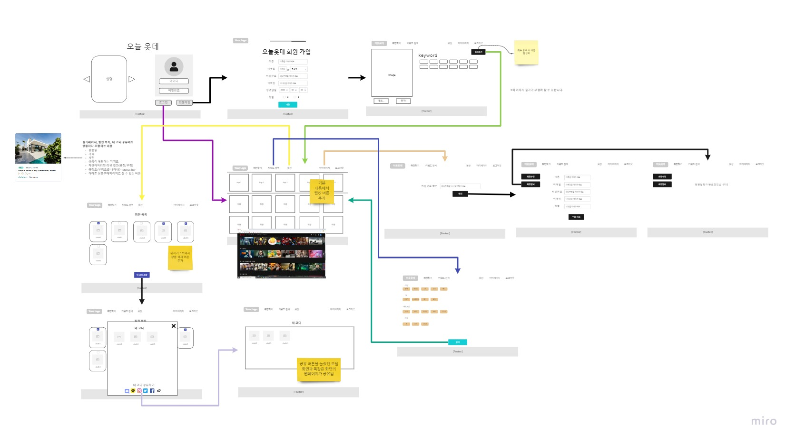

# 오늘옷데(ONOT) 웹 서비스
오늘옷데(ONOT)는 고객의 옷 선택에 따라 인공지능이 옷을 추천해주는 웹 서비스입니다.<br>
[배포된 주소](elice-kdt-ai-track-vm-distribute-21.koreacentral.cloudapp.azure.com)

# 목차
[[_TOC_]]


## 1. 웹 서비스 소개

- **사용자 취향 기반 실시간 옷 추천 서비스** 
- **선정 배경** : 
    사회가 고도화됨에 따라 개인의 취향이 점점 다양화 세분화 되고 있다. 나만의 부캐찾기, mbti 검사 등 자신을 정의하려는 것이 최근의 트렌드이다. 이런 변화에 반해 아직 대부분의 쇼핑몰은 성별순, 나이순 등 고객 개인의 범주 정보를 정렬 기준을 제시하고 있다. 이렇게 했을 때의 문제점으로는 고객의 취향을 정해진 범주에 한정시켜 소비자 만족도를 일정 단계 이상 끌어올리기 어렵다는 점이 있다. 이러한 문제점을 해결하고자 오늘옷데 서비스가 기획되었다.
- **문제 정의** : 
    오늘옷데는 기존의 '고객의 범주 정보에 맞춰 옷을 찾는' 패러다임을 뒤집어 고객이 원하는 옷과 키워드에서 인공지능이 카테고리를 추출하여 비슷한 다른 옷들을 제시하는 서비스를 제공한다. 이를 통해 개인은 틀에 갖히지 않고 본인에게 맞는 키워드와 옷을 고름으로서 맞춤형 옷을 쉽고 편하게 찾을 수 있다.
- **주요 기능** :
    - 좋아요/싫어요 게임을 통해 인공지능이 사용자의 취향을 파악하고 이에 맞춰 옷을 추천해주는 기능
    - 키워드 검색을 통해 원하는 제품을 인기순으로 보여주는 기능
    - 좋아하는 옷을 찜하고 찜한 옷들을 코디해 지인들과 공유하는 기능


## 2. 스토리보드

- 앞서 정의한 문제점에 따라 스토리보드를 구상했다. 
- 상세 스토리보드 링크는 다음과 같다 : [스토리보드 링크](https://miro.com/app/board/o9J_lE7TxL8=/)


## 3. 프로젝트 구성
### 1. **필요한 데이터셋**
- Amazon review data (2018) Jianmo Ni, UCSD
### 2. **기술 스택 및 라이브러리**

| 분류 | Tools | 목적 |
| ------ | ------ | ------ |
| Frontend | React | spa 구현 |
| Frontend | Recoil | React 상태 관리 |
| Frontend | Formik | Form 제어 |
| Frontend | reactdnd | 드래그 가능한 컴포넌트 구현 |
| Frontend | downshift | 선택 가능한 드롭다운 구현 |
| Frontend | axios | http request |
| Frontend | Material-ui | UI Components Library |
| Frontend | three.js | webGL Library |
| Frontend | framer | transition Library | 
| Frontend | lottie | after effect animation |
| Backend | Flask | 웹 서버 구동 |
| Backend | MySQL(SQLAlchemy) | 데이터베이스 |
| Backend | Flasgger | API 문서화 |
| Backend | Blueprint | API 모듈화 |
| AI | sklearn | train_test_split, confusion_matrix, TfidfTransformer, CountVectorizer, LogisticRegression |    
| AI | NLTK | NaiveBayesClassifier | 
| AI | pytorch-transformers | 문장요약을 위한 Bart 모델 사용 |
| AI | surprise - SVD | 추천 알고리즘 |
| AI | pandas | 데이터 가공 |


## 4. 구현 기능
> 이후 구현된 기능에 알맞는 스크린샷, 영상 등을 추가합니다.
1. **필수 구현**
    - Authentication : 회원가입 / 로그인 / 로그아웃 / 마이페이지(회원정보수정 및 탈퇴)
    - 좋아요∙싫어요 취향찾기 게임 
    - 키워드 검색
2. **선택 구현**
    - 옷장 : 찜하기를 바탕으로 나만의 코디 만들고 공유하기
    - 이스터에그 : 검색창에 팀원 이름 검색시 제품 대신 팀원 사진 등장시키기


## 5. 와이어프레임

- 스토리보드와 필수/선택 구현 기능을 바탕으로 상세한 와이어프레임을 작성하였다.
- 꾸준히 업데이트 중에 있다.
- 초기 와이어 프레임 링크는 다음과 같다 : [초기 와이어 프레임 링크](https://miro.com/app/board/o9J_lE5n5Oc=/)
- 개선된 와이어 프레임 링크는 다음과 같다 : [개선된 와이어 프레임 링크](https://www.figma.com/file/k7DLxBhj85AwvpuKjqsehq/WireFrame?node-id=0%3A1)


## 6. 세부 일정
- 현재 5주차 개발 진행 중에 있다.
### 1주차
    - 주제 설정 및 기획
    - 아이디어 로드맵 / ui 적용하지 않은 와이어프레임 작성
    - docker, commit 템플릿, eslint-prettier, editorconfig, pre-commit 등 협업을 위한 환경 설정
### 2주차
    - swagger를 이용한 문서화
    - 로그인 구현
    - 마이페이지 구현
    - 데이터 전처리
    - 인공지능 구현을 위한 자료조사
    - ui 컴포넌트 구현
### 3주차
    - 게임 페이지, 메인페이지  제작 시작
    - ui 컴포넌트 정돈 시작
    - 와이어프레임 구체화 및 발전
### 4주차
    - 웹서비스 배포
    - 인공지능 모델 구현 확정
    - 데이터 전처리 및 학습하여 웹에 도입할 준비 마무리
    - 게임, 메인 페이지 제작 완성
    - 옷장페이지 구현
### 5주차
    - 모든 기능 구현 마무리
    - 코드 리팩토링 및 기능 업그레이드
    - 구현 완료된 기능 디버깅
    - 웹 배포 확인

## 7. 역할

| 이름 | 담당 업무 |
| ------ | ------ |
| 남다영 | 프론트엔드 |
| 황정우 | 프론트엔드 |
| 강인선 | 백엔드, 인공지능 |
| 김다인 | 백엔드, 인공지능 |
| 김신성 | 인공지능 |


## 8. 배운 점
- **남다영** : [배운점 링크](https://kdt-gitlab.elice.io/001-part4-aifashionkeyword/team1/project-team1/-/blob/sprint/front/today-fashion/README.md)

- **강인선** : 
    - 백엔드의 역할을 하며 프론트와 인공지능 파트와 협업을 하면서 문서화를 하고 이슈를 공유하는 것의 중요성을 알게 되었다. 
    - 그동안 프로젝트를 진행하며 쿼리 속도에 대한 고민을 깊게 하지 않았는데 이 프로젝트를 통해 큰 데이터를 다루며 속도에 관한 고민을 많이 할 수 있었다. 개발을 하면서 이후의 관리를 신경쓰려고 노력한 덕분에 이슈가 생겼을 때 보다 빠르게 반응할 수 있었다.
    - 키워드를 추출하는 과정에서 자연어처리에 대한 기본적인 지식을 얻을 수 있었다. 
    - 데이터를 db modeling 한 것과 맞추는 과정에서 데이터처리 라이브러리들에 대해 조금 더 능숙 해 질 수 있었다.

- **김다인** : 
    - 데이터 전처리와 인공지능 요약 모델을 적용하는데에 있어서 어려움을 겪었다. 인공지능 모델 적용을 위해 azure의 jupyter notebook과 colab pro를 동시에 사용했다. azure의 경우 memory가 작아 라이브러리를 다운받거나 데이터를 다운받다가 동작이 멈추는 경우가 허다했다. 반면 colab의 경우 용량 문제는 없었으나 중간에 연결이 끊어져 작업중이던 데이터들이 날아가는 경우가 종종 발생했다. 이러한 문제를 해결하기 위해 azure에서는 안 쓰는 라이브러리와 데이터들을 그 때 그 때 삭제하며 용량을 확보해주어야했고, colab의 경우 tqdm이라는 라이브러리를 사용하여 학습 시간을 예상하고 학습시간이 오래걸리는 작업의 경우 azure로 옮겨서 작업했다. 또 인공지능 요약 모델의 경우 방대한 데이터 양으로 인해 처리 속도가 오래걸리는 문제점이 있었다. 구글링 와중 huggingface transformer의 pipeline object이 gpu를 자동으로 사용한다는 점을 알게 되어 gpu를 사용함으로서 요약 속도를 절반 정도 단축시켰다. 이를 통해 한정된 자원에서 빠른 속도로 원하는 결과물을 뽑아내기 위해 필요한 여러 방법론들에 대해 배울 수 있었다. 
    - 프론트엔드와 소통하기 위해 flask에서 사용하는 swagger 라이브러리인 flasgger를 사용했다. 이전 프로젝트에서 flasgger를 사용할 때는 jwt_token을 사용하지 않았어서 jwt_token을 flasgger에 적용시키는 것이 새로운 문제점으로 대두되었다. 스택오버플로우와 flasgger 공식문서를 보며 시도해본 결과 openapi 버전이 낮아서 jwt_token이 적용되지 않고 있었음을 알아냈고, 적용시키는 것에 성공했다. 그 밖에 프론트엔드와 소통하며 프론트엔드에서 필요로 하는 정보들을 문서화하는 기법에 대해 더 심도깊게 배울 수 있었다.
    - 인공지능 모델의 속도가 오래 걸려서 적용하는데에 시간이 걸렸다. 이에 celery와 redis를 사용하여 인공지능 모델이 적용된 api를 비동기화 시켜서 사용자 경험을 향상시키고자 하였으나 계속되는 경로 문제로 이를 해결하지 못했다. 당장은 시간에 쫓겨 문제를 완전히 해결하지 못한채 남겨놓지만 추후 더 공부해서 해결하고자 한다.

- **김신성** : 
    - 프로젝트를 진행하면서 데이터 분석과 인공지능에 어느정도 자신감이 있었는데 아직은 모르는게 많다는 걸 느꼈다. 데이터 가공은 늘 어느정도 정제가 된 데이터로 학습을 진행하였는데 이번 아마존 데이터와 같이 정제가 되어있지 않는 데이터를 가공하면서 기존에 알지 못했고 생각하지 못한 가공법을 배웠고 인공지능은 어렴풋이 이해하고 있던 내용들을 더 깊게 이해할 수 있었다. 그 동안 독학으로 혼자 하는것에 익숙했는데 팀원과 힘을 합쳐서 문제를 해결해 가면서 팀 프로젝트의 이점을 배웠다.


# 환경설정/실행
## 환경설정
`project/back` 폴더 내에서 아래 코드 실행
```
pip3 install -r requirements.txt
```
## 실행 방법
### Frontend
`project/front/today-fashion` 폴더 내에서 아래 코드 실행
```
yarn install
yarn start
```


### Backend
`project/back` 폴더 내에서 아래 코드 실행
```
export FLASK_APP=fashion
export FLASK_ENV=development
export LANG=C.UTF-8
flask run
```

# Browser 지원
- Google Chrome 9+
- Firefox 4+
- Opera 15+
- Safari 5.1+
- Microsoft Edge


# 참고 자료
- Justifying recommendations using distantly-labeled reviews and fined-grained aspects Jianmo Ni, Jiacheng Li, Julian McAuley
- Empirical Methods in Natural Language Processing (EMNLP), 2019